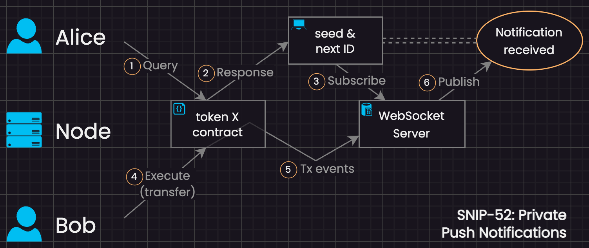

# SNIP-52 - Private Push Notifications

Allows clients to receive notifications when certain events within a smart contract affect them. For example: token transfers, direct messaging, turn-based gaming, announcements, and so on.

* [Introduction](#introduction)
  * [Motivation](#motiviation)
  * [Overview](#overview)
    * [How it works](#how-it-works-high-level)
    * [Example flow](#example-flow)
    * [Diagram](#diagram)
* [Concepts](#concepts)
  * [Notification ID](#notification-id)
  * [Channels](#channels)
  * [Notification Seed](#notification-seed)
  * [Internal Contract Secret](#internal-contract-secret)
  * [Counter](#counter)
  * [Notification Data](#notification-data)
* [Queries and Methods](#queries-and-methods)
  * [ListChannels Query](#listchannels-query)
  * [ChannelInfo Query](#channelinfo-query)
  * [UpdateSeed Method](#updateseed-method)
* [Algorithms](#algorithms)
  * [Contract Internal Secret Derivation](#contract-internal-secret-derivation)
  * [Notification Seed Algorithm](#notification-seed-algorithm)
  * [Updating Seed Algorithm](#updating-seed-algorithm)
  * [Notification ID Algorithm](#notification-id-algorithm)
  * [Notification Data Algorithms](#notification-data-algorithms)
  * [Dispatch Notification Algorithm](#dispatch-notification-algorithm)
* [Cryptography](#cryptography)
* [Notification ID Algorithm](#notification-id-algorithm)
* [Privacy Considerations](#privacy-considerations)
  * [Decoys](#decoys)

# Introduction

## Motivation 

Wallets and dApps currently resort to a polling-based approach in order to notice changes to a user's private state within a contract.

For example, a dApp might periodically query a set of SNIP-2x token contracts to discover a new incoming transfer.

However, this approach of querying contracts every so often is inefficient and can create unwanted load on query nodes. Additionally, there is no clear best practice for determining an optimal polling rate.


## Overview

This document presents a technique that allows clients to receive notifications for specific future events (e.g., "next incoming transfer of token X", or "once it is my turn in chess") such that all information about the notification (e.g., its recipient, supplemental data, and whether or not an event actually ocurred) remains private, encrypted, and unaccessible to outside observers.

Keep in mind, the only time smart contracts mutate state is during execution, which can only occur during a network transaction. For example, Alice's "token X" balance can only ever change in response to a transaction that executes some method on that contract (e.g., "Bob transfers 100 token X to Alice"). It is only in response to these executions that a contract would emit a notification to notify some recipient(s) of an event that affected them (e.g., "hey Alice, someone just transferred tokens to your account").


### How it works (high-level)

First, let's review the basic components that make this possible:

1. The existing [Tendermint event stack](https://docs.tendermint.com/v0.34/tendermint-core/subscription.html) is a [publish-subscribe](https://en.wikipedia.org/wiki/Publish%E2%80%93subscribe_pattern) model that allows nodes to transmit network events directly to subscribed clients. It does so using JSONRPC over WebSockets.

2. Leveraging the [`add_attribute_plaintext(...)`](https://github.com/scrtlabs/SecretNetwork/blob/ddb9b67a23a2eb5f64076fa3e0a836d186a02b63/cosmwasm/contracts/v1/compute-tests/test-compute-contract/src/contract.rs#L60C1-L62) API method, Secret Contracts can add custom key-value attributes to the transaction's log.

3. Clients coordinate with smart contracts to determine globally unique, single-use "Notification IDs" which represent specific future events. When one of those specific events occur, its Notication ID is added to the transaction log as a custom attribute. Since the contract and recipient are the only parties aware of a Notification ID's significance, the event in that transaction's log is what discreetly notifies the recipient, effectively creating a private push-based notification service.


### Example flow

Let's walk through a simple example, where client Alice wants to be notified next time she receives a transfer of token X into her account.

> NOTE: Example uses fake base64 data for brevity

1. Alice queries the token X contract to get the unique Notification ID for her next incoming transfer:
    ```json
    {
      "channel_info": {
        "channel": "transfers"
      }
    }
    ```

2. The contract responds:
    ```json
    {
      "channel_info": {
        "channel": "transfers",
        "seed": "ecc7f60418aa",
        "counter": "3",
        "next_id": "ZjZjYzVhYjU4",
        "as_of_block": "1131420"
      }
    }
    ```

    Alice now has a globally unique Notification ID the contract will use next time someone transfers tokens to her account.

    Furthermore, Alice now has a seed she can use to derive future Notification IDs offline for subsequent transfer events (i.e., without having to query this contract again)

3. Alice subscribes to execution events on the token contract:
    ```json
    {
      "jsonrpc": "2.0",
      "id": "0",
      "method": "subscribe",
      "params": {
        "query": "wasm.contract_address='secret1ku936rhzqynw6w2gqp4e5hsdtnvwajj6r7mc5z'"
      }
    }
    ```

    Alice will now receive a JSONRPC message for each new execution of the contract, from which she can search for her unique Notification ID.
    
    Alternatively, if she trusts the WebSocket server won't record her activity, she can use a filter in the `query` field of her subscription message, e.g., `wasm.ZjZjYzVhYjU4 EXISTS` .

4. Some time later, Bob executes a SNIP-20 transfer of token X to Alice's account:
    ```json
    {
      "transfer": {
        "recipient": "Alice",
        "amount": "100",
      }
    }
    ```

5. The contract derives the next transfer Notification ID for the recipient (Alice) and adds it as a custom attribute to the transaction log.
    ```json
    {
      "...": {},
      "events": {
        "...": ["..."],
        "wasm.ZjZjYzVhYjU4": ["aW8yMTN1MTJp"]
      }
    }
    ```

6. The WebSocket server transmits the transaction event JSONRPC message to Alice. Alice finds the expected attribute key `"wasm.ZjZjYzVhYjU4"` and the notification has been received.


### Diagram




### Remarks on the above example

Once Alice has obtained her Notification Seed for the desired channel, she no longer needs to query the contract and steps 4-6 can repeat ad infinitum.


# Concepts

### Notification ID

A globally unique, single-use identifier that is deterministically generated using a cryptographic hash function. Notification IDs can be generated by both contract and client.

An event's Notification ID is used for the custom attribute's key in the transaction log, i.e., `"wasm.${NOTIFICATION_ID}": "${ENCRYPED_NOTIFICATION_DATA}"`.


### Channels

Allows a contract to distinguish between different types of events affecting a recipient. For example, an NFT trading contract might have separate channels for "bids" and "buys".


### Notification Seed

A shared secret between client and contract, used as input key material when deriving Notification IDs. It is required to have high entropy. Therefore, clients are only allowed to modify seeds using digital signatures. See [UpdateSeed](#updateseed-method) for more info.


### Internal Contract Secret

By default, contracts derive a client's Notification Seed using an internal secret not known to ANY party (including admins). This allows clients to obtain their Notification IDs without having to execute a transaction. For an increased privacy guarantee, clients can execute a transaction to set a new Notification Seed.


### Counter

In order to generate a unique Notification ID for each subsequent event, clients and contracts MUST produce a number only used once (i.e., a nonce) as input to the hash function. They must share an understanding for how/when to increment the nonce so that clients can continue to derive new Notification IDs offline.

To meet these criteria, a simple counter scheme is used to derive new nonce values, meaning that the nonce MUST increment by exactly one for each new notification. That way, clients and contracts are able to keep their nonce values in sync.


### Notification Data

Contracts MAY optionally provide supplemental data with each notification. For example, a transfer notification may include the sender's address and token amount, encrypted in the attribute's value, i.e., `"wasm.${NOTIFICATION_ID}": "${ENCRYPED_NOTIFICATION_DATA}"`.

Developers looking to take advantage of this option should understand that ALL notifications (including decoys) will need to pad notification data to some predetermined maximum length in order to avoid privacy leaks. It is generally advised to design such payloads to be as short as possible.

Contracts SHOULD encode notification data using [CBOR](https://cbor.io/spec.html), where the top-level element is always an array of mixed types. Furthermore, contracts SHOULD provide a Concise Data Definition Language (CDDL) definition string in the [ChannelInfo Query](#channelinfo-query) response (under the `"cddl"` key) which describes the payload.

Walking through the basic SNIP-2x "transfers" example, a notification would want to include the amount received and the sender. Since the token amount could possibly exceed the range of `uint64`, we use `biguint` instead. To keep the payload as short as possible, we transmit the sender's address in canonical byte form. An appropriate CDDL for its channel would look like this:
```cddl
transfers = [
  amount: biguint,  ; number of indivisible token units
  sender: bstr,     ; byte sequence of sender's canonical address
]
```

Now imagine Bob transfers 1.25 token X to Alice. The corresponding information would be as follows:
```
amount: 1250000 micro TKN
sender: secret1dg4gt6fc2avp2ywgvrxxmptc670av0372u2gv5
```

Encoding this information in CBOR according the above "transfers" schema results in the following payload (shown here in diagnostic notation):
```cbor-diag
[1250000, h'6a2a85e93857581511c860cc6d8578d79fd63e3e']
```

For more information about CBOR and CDDL:
 - [Specs](https://cbor.io/spec.html)
   - [CBOR Specification](https://www.rfc-editor.org/rfc/rfc8746.html)
   - [CDDL Specification](https://cbor-wg.github.io/cddl/draft-ietf-cbor-cddl.html)
 - [Tools](https://cbor.io/tools.html)
 - [Impls](https://cbor.io/impls.html)
 - [CDDL Examples](https://github.com/cbor-wg/cddl/blob/master/cddl-examples.md)


# Queries and Methods


## ListChannels Query

Public query to list all notification channels.

Query:
```json
{
  "list_channels": {},
}
```

Response:
```json
{
  "list_channels": {
    "channels": [
      "<id of channel 1>",
      "...",
      "<id of channel N>"
    ]
  }
}
```

## ChannelInfo Query

Authenticated query allows clients to obtain the seed, counter, and Notification ID of a future event, for a specific channel.

Query:
```json
{
  "channel_info": {
    "channel": "<id of channel>"
  }
}
```

Response:
```json
{
  "channel_info": {
    "channel": "<same as query input>",
    "seed": "<shared secret in base64>",
    "counter": "<current counter value>",
    "next_id": "<the next Notification ID>",
    "as_of_block": "<scopes validity of this response>",
    "cddl": "<optional CDDL schema definition string for the CBOR-encoded notification data>"
  }
}
```

The response includes the Notification ID of the next event in the given channel affecting the given viewer (who is specified in the authentication data, depending on whether a query permit or viewer key is used).

The response also provides the viewer's current seed for the given channel, allowing the client to derive future Notification IDs for this channel offline (i.e., without having to query the contract again).


## UpdateSeed Method

Allows clients to set a new shared secret. In order to guarantee the provided secret has high entropy, clients must submit a signed document params and signature to be verified before the new shared secret (a SHA-256 hash of the signature) is accepted.

See the [Updating Seed Algorithm](#updating-seed-algorithm) for details on how the contract should handle this message.

The signed document follows the same format as query permits, but with `type` `"notification_seed"` and `value` containing two fields: `contract` and `previous_seed`:
```json
{
  "chain_id": "secret-4",
  "account_number": "0",
  "sequence": "0",
  "msgs": [
    {
      "type": "notification_seed",
      "value": {
        "contract": "<bech32 address of contract>",
        "previous_seed": "<base64-encoded value of previous seed>"
      }
    }
  ],
  "fee": {
    "amount": [
      {
        "denom": "uscrt",
        "amount": "0"
      }
    ],
    "gas": "1"
  },
  "memo": ""
}
```

Request:
```json
{
  "update_seed": {
    "signed_doc": {
      "params": {
        "chain_id": "secret-4",
        "contract": "<bech32 address of contract>",
        "previous_seed": "<base64-encoded value of previous seed>"
      },
      "signature": {
        "pub_key": {
          "type": "tendermint/PubKeySecp256k1",
          "value": "<33 bytes of secp256k1 pubkey as base64>"
        },
        "signature": "<64 bytes of secp256k1 signature as base64>"
      }
    }
  }
}
```

Response:
```json
{
  "update_seed": {
    "seed": "<shared secret in base64>"
  }
}
```


# Algorithms

## Contract Internal Secret Derivation

Contracts should strive to create an internal secret such that even the creator cannot predict or extract its contents.

Typically, such secrets are generated upon initialization. A suitably strong and robust method for generating this secret combines user-provided entropy and Secret Network's verifiable randomness API. Pseudocode for reference only:
```
fun initializeContract(msg, env) {
  // gather entropy from sender
  let userEntropy := msg.entropy

  // extend entropy with environmental information
  userEntropy := concat(
    env.blockHeight,
    env.blockTime,
    env.senderAddress,
    userEntropy
  )

  // the crux: obtain a unique, cryptographically-strong random value associated with this execution
  let seed := env.random()

  // also very important: derive the contract's internal secret using HKDF
  let internalSecret := hkdf(ikm=seed, salt=sha256(entropy), info="contract_internal_secret", length=32)

  // save to storage
  saveInternalSecretToStorage(internalSecret);

  // ...
}
```

> NOTE: The above approach would still allow a malicious contract deployer to hypothetically deduce the contract's internal secret. In order to achieve greater levels of trust, the process of deriving the internal secret would require several subsequent executions where multiple third parties provide additional (secret) entropy. However, such an approach is complex and outside the scope of this document.


## Notification Seed Algorithm

Pseudocode for settling on a seed to use (contract):
```
fun getSeedFor(recipientAddr) {
  // recipient has a shared secret with contract
  let seed := sharedSecretsTable[recipientAddr]

  // no explicit shared secret; derive seed using contract's internal secret
  if NOT exists(seed):
    seed := hkdf(ikm=contractInternalSecret, info=canonical(recipientAddr))

  return seed
}
```


## Updating Seed Algorithm

Pseudocode for verifying [`update_seed`](#updateseed-method) arguments and storing new seed (contract):
```
fun updateSeed(recipientAddr, signedDoc, env) {
  // check that the params are accurate
  assert(signedDoc.params.contract == env.contractAddr)
  assert(signedDoc.params.previous_seed == sharedSecretsTable[recipientAddr])

  // verify that the signature belongs to the sender and is for the given signed document
  verifySecp256k1Signature(env.senderPubKey, signedDoc.signature, {
    "chain_id": signedDoc.params.chain_id,
    "account_number": "0",
    "sequence": "0",
    "msgs": [
      {
        "type": "notification_seed",
        "value": {
          "contract": signedDoc.params.contract,
          "previous_seed": signedDoc.params.previous_seed
        }
      }
    ],
    "fee": {
      "amount": [
        {
          "denom": "uscrt",
          "amount": "0"
        }
      ],
      "gas": "1"
    },
    "memo": ""
  })

  // hash the signature to get the 32 byte shared secret
  let sharedSecret := sha256(signedDoc.signature.signature)

  // save the shared secret to storage associated with the given recipient
  saveToSharedSecretsTable(recipientAddr, sharedSecret)
}
```


## Notification ID Algorithm

Pseudocode for generating Notification IDs (both contract & client):
```
fun notificationIDFor(contractOrRecipientAddr, channelId) {
  // counter reflects the nth notification for the given contract/recipient in the given channel
  let counter := getCounterFor(contractOrRecipientAddr, channelId)

  // compute notification ID for this event
  let seed := getSeedFor(contractOrRecipientAddr)
  let material := concatStrings(channelId, ":", uintToDecimalString(counter))
  let notificationID := hmac_sha256(key=seed, message=utf8ToBytes(material))

  return notificationID
}
```


## Notification Data Algorithms

Contracts are encouraged to use [CBOR](https://cbor.io/) to encode/decode information in the notification data.

Pseudocode for encrypting data into notifications (contract):
```
fun encryptNotificationData(recipientAddr, channelId, plaintext, env) {
  // counter reflects the nth notification for the given recipient in the given channel
  let counter := getCounterFor(recipientAddr, channelId)

  let seed := getSeedFor(recipientAddr)

  // ChaCha20 expects a 96-bit (12 bytes) nonce. encode uint64 counter using BE and left-pad with 4 bytes of 0x00
  let nonce := concat(zeros(4), uint64BigEndian(counter))

  // right-pad the plaintext with 0x00 bytes until it is of the desired length (keep in mind, payload adds 16 bytes for tag)
  let message := concat(plaintext, zeros(DATA_LEN - len(plaintext)))

  // construct the additional authenticated data
  let aad := concatStrings(env.blockHeight, ":", env.senderAddress)

  // encrypt notification data for this event
  let [ciphertext, tag] := chacha20poly1305_encrypt(key=seed, nonce=nonce, message=message, aad=aad)

  // concatenate ciphertext and 16 bytes of tag (note: crypto libs typically default to doing it this way in `seal`)
  let payload := concat(ciphertext, tag)

  return payload
}
```


Pseudocode for decrypting data from notifications (client):
```
fun decryptNotificationData(contractAddr, channelId, payload, env) {
  // counter reflects the nth notification for the given contract in the given channel
  let counter := getCounterFor(contractAddr, channelId)

  // ChaCha20 expects a 96-bit (12 bytes) nonce. encode uint64 counter using BE and left-pad with 4 bytes of 0x00
  let nonce := concat(zeros(4), uint64BigEndian(counter))

  // construct the additional authenticated data
  let aad := concatStrings(env.blockHeight, ":", env.senderAddress)

  // split payload
  let ciphertext := slice(payload, len(payload) - 16)
  let tag := slice(payload, len(ciphertext))

  // decrypt notification data
  let seed := getSeedFor(contractAddr)
  let message := chacha20poly1305_decrypt(key=seed, nonce=nonce, message=ciphertext, tag=tag, aad=aad)
  let plaintext := trimTrailingZeros(message)

  return plaintext
}
```


## Dispatch Notification Algorithm

Pseudocode for dispatching a notification (contract):
```
fun dispatchNotification(recipientAddr, channelId, plaintext, env) {
  // obtain the current notification ID
  let notificationId := notificationIDFor(recipientAddr, channelId)

  // construct the notification data payload
  let payload := encryptNotificationData(recipientAddr, channelId, plaintext, env);

  // increment the counter
  incrementCounterFor(contractAddr, channelId)

  // emit the notification
  addAttributeToEventLog(notificationId, payload)
}
```


## Cryptography

A quick overview of cryptographic schemes used:


### HKDF

The contract must [derive an internal secret](#contract-internal-secret-derivation) upon initialization.

Subsequently, the contract uses its internal secret and a recipient's address to derive a unique key for that recipient without them having to execute a tx (it gets shared when they make an authenticated query for it).


### Secp256k1

Recipients can optionally establish a new shared secret with the contract to provide better security against hypothetical side-chain attacks. The contract enforces determinism and high entropy for new shared secrets by requiring users to [submit a signed document](#updateseed-method) that references the previous seed.


### HMAC-SHA256

Used to [generate Notification IDs](#notification-id-algorithm).


### ChaCha20-Poly1305

This AEAD (authenticated encryption with additional data) algorithm was selected to encrypt and authenticate notification data based on its low-cost performance profile, making very efficient use of gas, and its widespread adoption, simplifying both contract and client-side implementations.

Within the contract, implementations are advised to use RustCrypto's AEADs ([docs](https://docs.rs/chacha20poly1305/latest/chacha20poly1305/), [crate](https://crates.io/crates/chacha20poly1305), [GitHub](https://github.com/RustCrypto/AEADs)), which has been audited for usage inside SGX enclaves ([report](https://research.nccgroup.com/2020/02/26/public-report-rustcrypto-aes-gcm-and-chacha20poly1305-implementation-review/)).


## Privacy Considerations

The following section describes a hypothetical side-chain attack. It's important however to note the similarity to attacks based on storage access patterns (i.e., spicy printf), which actually expose more private data and should therefore be considered a greater threat. In both cases, using a system of decoys is the current best mitigation in practice.

If a contract action allows _any sender_ to trigger a notification for some recipient, then there is a risk that an attacker could perform a side-chain attack to precompute a victim's next Notification ID for a specific channel within a contract.

For example, Mallory could fork the chain, transfer 10 token X to Alice, record the emitted Notification ID, and then wait to observe that same Notification ID on the actual chain. At that point, Mallory would be able to deduce that _someone_ transferred _some amount_ of token X to Alice.

Notice that the threat model looks very different if the contract only allowed friends of Alice to transfer tokens to her account (i.e., no longer _any sender_). In that case, only a friend of Alice would be able to perform the attack.

Also notice that if Alice executes the UpdateSeed method after Mallory forks the chain and before Bob transfers tokens, then Mallory's attack fails.


### Decoys

To mitigate privacy risks exposed by side-chain attacks, contracts should employ a system of decoys.

Due to the fact that most vulnerable actions (e.g., transfers) tend to also be those most affected by storage access patterns, contracts should strive to emulate every part of the action with decoys.

For example, when Alice transfers token 10 X to Bob, the contract should also transfer 0 token X to Charlie, and 0 token X to David, causing the full repercussions for both Charlie and David as decoy recipients. Bob, Charlie and David should all receive a new record in their transfer history, even though Charlie and David will each see that 0 tokens were transferred to their account. The purpose of updating their transfer history is to create storage access pattern noise, so that an attacker cannot deduce which recipient's balance actually changed. Similarly, Bob, Charlie and David will all receive a notification; although Charlie and David will know to ignore it when they decrypt the Notification Data and find that 0 tokens were transferred to their account.
